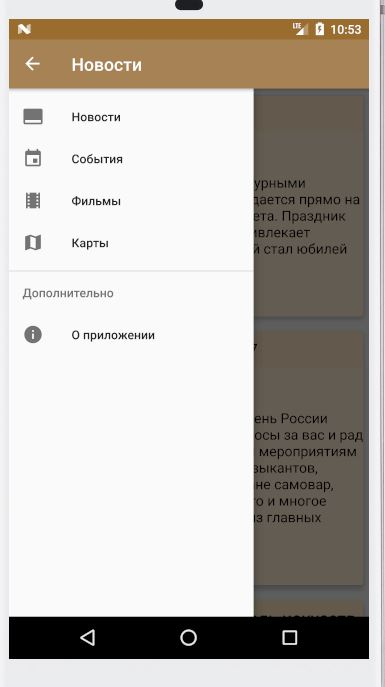
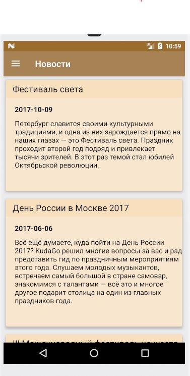
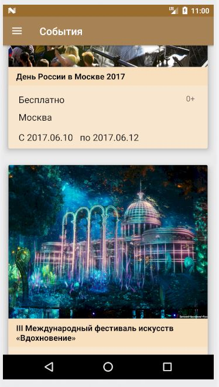
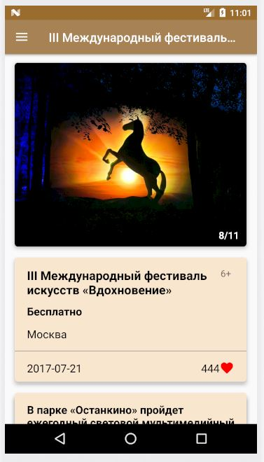
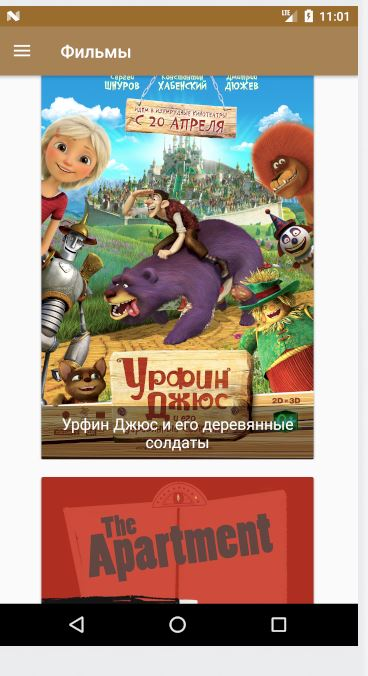
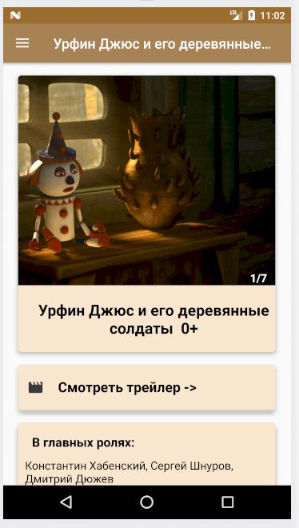
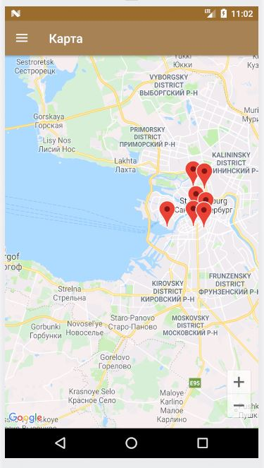

Данное клиент-серверное приложение служит для отображения событий, мероприятий, новостей, взятых с API kudago.ru.  https://docs.kudago.com/api/   
Архитектура приложения - MVP  
В приложении были использованы следующие технологии:  
  - Java 8
  - Google Map API
  - RecyclerView
  - CardView
  - Retrofit 2
  - GSON
  - RxJava 2
  - Dagger 2
  - Glid
  
В приложении есть 5 основных окон:  
​  

Список новостей:  
​  

Список событий и подробная информация конкретного события:  
​ ​  

Список фильмов и подробная информация конкретного фильма:  
​ ​  

Окно с картой, но которой показаны события. По клику на маркер отображается детальная информация данного события:  
​

